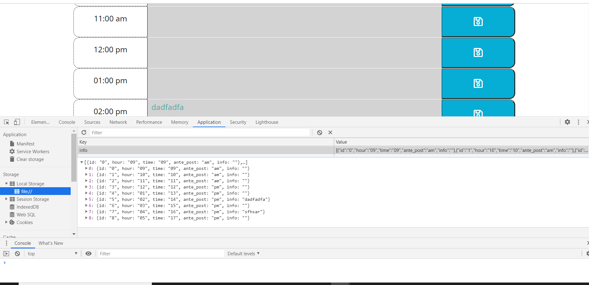

#  Work Day Scheduler

* Calander application that stores notations by the hour in a text area that can be saved

# Description

* Developed using bootstrap, jQuery and dynamically updating the html view of work day scheduler
* The current date and time is displayed at the top of the scheduler
* The Work Day Scheduler will have the hours of the day on the home page with a text area and a save button 
* The text area can be saved after input of daily schedule with the save button
* The ability to delete text by selecting the text > deleting the text > and clicking the save button
* If the user does not use the save button and the page is refreshed the enteries are not saved 
* If the text entries are saved then the information will persist in local storage

# This is an animation of the project and how it should look and function

# Work Day Scheduler

* Home page---
* When the scheduler is opened the view is presented to the user with the current date and time in the Jumbotron banner
    * This functionality is developed with jQuery and the moment.js library to get the exact date and time
    * The daily hours are displayed 9am - 5pm with a notation or text area for daily planning
    * Each hour of the day is compared to current time from moment.js
    * If the hour is past, present, or future, the color style will change accordingly
* Type and save your daily activities for work (see Tests below)
* Link to the deployed site: https://victorsc45.github.io/Work-Day-Scheduler/

# Spec Criteria

* User is presented with a daily planner to create a schedule:  
    * the current day is displayed at the top of the calendar
    * presented with timeblocks for standard business hours
    * each timeblock is color coded to indicate whether it is in the past, present, or future
    * click into a timeblock and enter an event for the day
    * click the save button for that timeblock
    * the text for that event is saved in local storage or the deletion of an event is also stored
    * refresh the page  the save events persist

# Minimum Requirements
* Work day Scheduler that accepts text input and saves to local storage 
* Time blocks must change color style as past present or future 
* Curennt Date and Time is displayed 
* Must use moment.js to create functionality
* Functional deployed application
* GitHub repository with Readme describing the project
* Must properly utilize Bootstrap components and grid system for responsive sizing of application

# Instulation

N/A at this time simply follow the url provided above plan the day by saving entries to the page

# Review

The current time and date must be displayed and the hours of the day time blocks must reflect different colors for hours past, present, and future.
The DOM elements were created in jQuery on the js page of this application and the local storage is working correctly.

# Credits 

'''' https://learn.jquery.com/using-jquery-core ''''

'''' The [Moment.js](https://momentjs.com/) library to work with date and time. ''''

'''' https://developer.mozilla.org/en-US/docs/Web/HTML ''''

'''' https://www.w3.org/standards/webdesign/accessibility ''''

'''' bootstrap components link starting 'A' and descending 

     https://getbootstrap.com/docs/4.5/components/alerts/ ''''

##  /askBCS @iarcones learning assistant :)

# License 

Open to the public website for Work Day Scheduler

# Tests

* test by accessing URL above and make entries in the time block text area
* Check that the enteries are saved by refreshing the page or accessing:
    * the local storage / check local storage in console > application > Localstorage
* Local Storage Image test:

